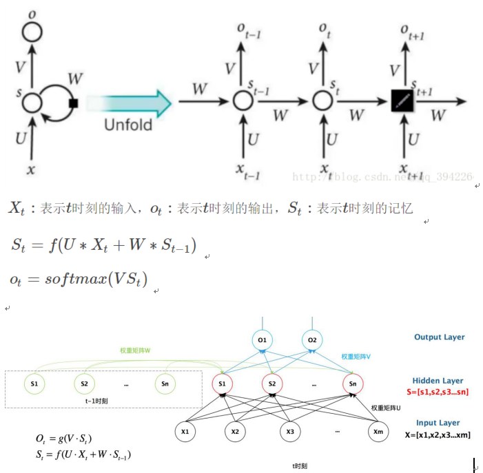
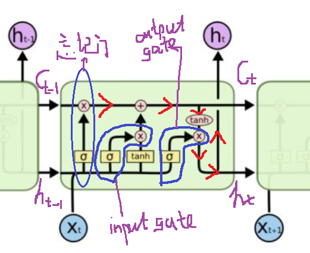
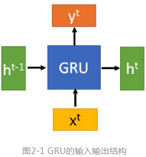

RNN
=========
隐藏层之间的节点不再无连接而是有连接的，并且隐藏层的输入不仅包括输入层的输出还包括上一时刻隐藏层的输出。

基础可以参考https://zhuanlan.zhihu.com/p/30844905

1. 抽象网络结构
2. 上图中，St也表示t时刻循环神经元的状态
3. 按时序展开的网络结构
4. 按neuron展开的网络结构
5. hidden layer在t-1时刻的输出是怎么和input layer在t时刻的输出结合，从而影响hidden layer在t时刻的输出的。
6. 为什么循环神经网络可以往前看任意多个输入值呢？从公式看，是一个反复带入的过程。https://www.jianshu.com/p/39a99c88a565
7. 另外的参考链接 https://zhuanlan.zhihu.com/p/32755043

训练算法BPTT
--------------
Back propagation through time

1. RNN中有三个超参数矩阵，U, V, W，所以，t时刻的误差反向传播到hidden layer后，要向U和W两个方向传播

BRNN 
-----------
Bi-directional Recurrent Neural Network (BRNN)，可以参考
https://blog.csdn.net/jojozhangju/article/details/51982254

1. 按时序展开的网络结构
2. 神经网络结构的特点是：两个RNN连接相同的input layer和output layer
3. Output layer输出的计算过程

Long Short-Term Memory (LSTM)-RNN
--------------------------------------

在这个间隔不断增大时，RNN 会丧失学习到连接如此远的信息的能力。
和RNN相比，LSTM多了一个隐状态变量，称为细胞状态（cell state），用来记录信息。LSTM和GRU的关键是会选择性地忽略其中一些词，不让其参与到隐层状态向量的更新中，最后只保留相关的信息进行预测。

GRU-RNN
----------

LSTM简化变体，LSTM和GRU的关键是会选择性地忽略其中一些词，不让其参与到隐层状态向量的更新中，最后只保留相关的信息进行预测。用来缓解梯度消失问题。

这个知乎链接,https://zhuanlan.zhihu.com/p/32481747,讲解的很生动，醍醐灌顶，看这一篇足矣。

注意力模型
---------------
LSTM的下一个重大突破，

只要你睁着眼，注意力模型就无时不刻在你身上发挥作用，比如你过马路，其实你的注意力会被更多地分配给红绿灯和来往的车辆上，虽然此时你看到了整个世界；

没有引入注意力的模型在输入句子比较短的时候估计问题不大，但是如果输入句子比较长，此时所有语义完全通过一个中间语义向量来表示，单词自身的信息已经消失，可想而知会丢失很多细节信息，这也是为何要引入注意力模型的重要原因。