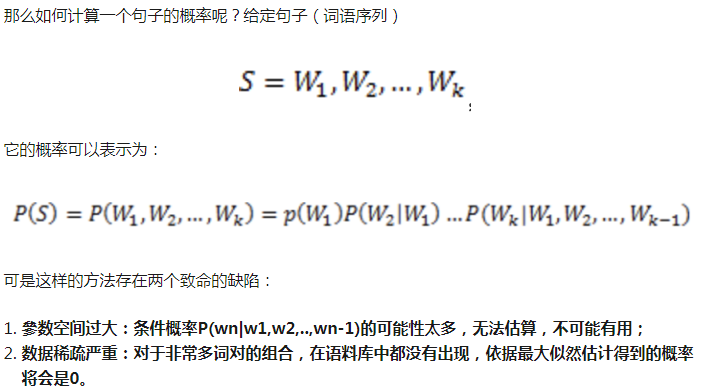
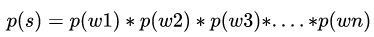
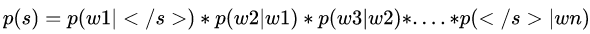
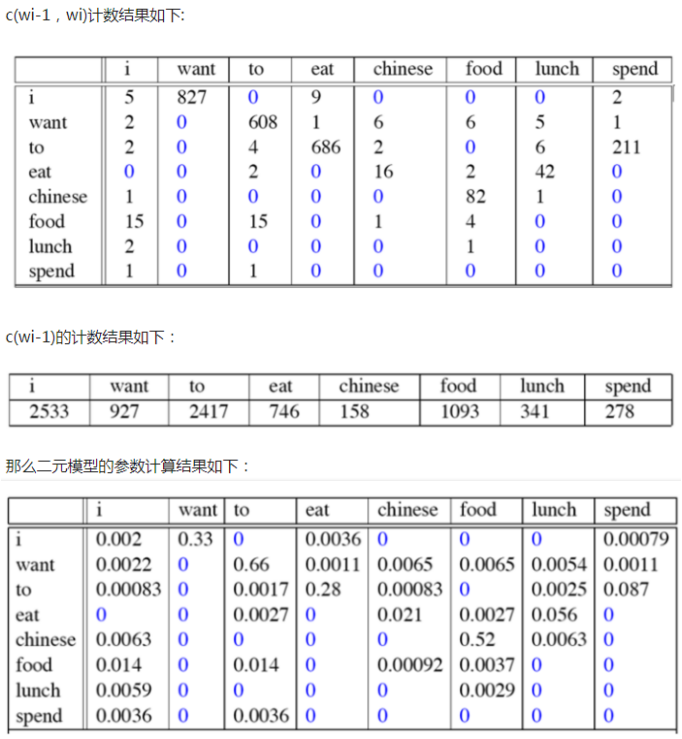
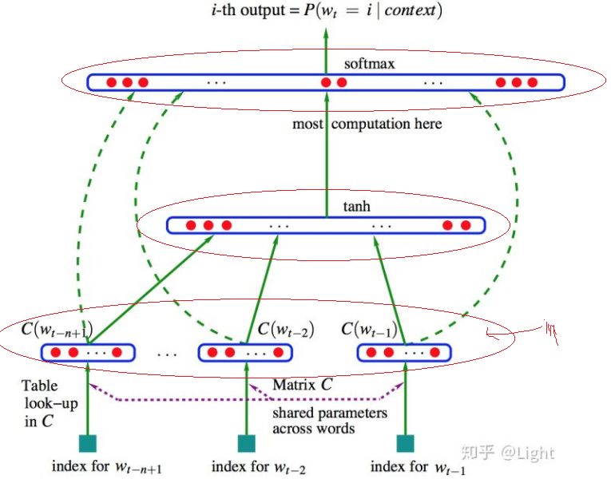
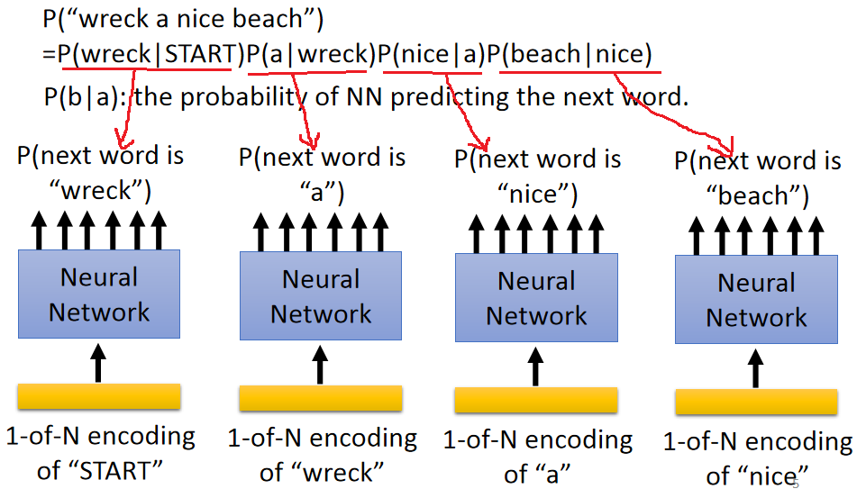
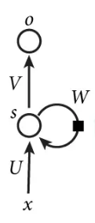
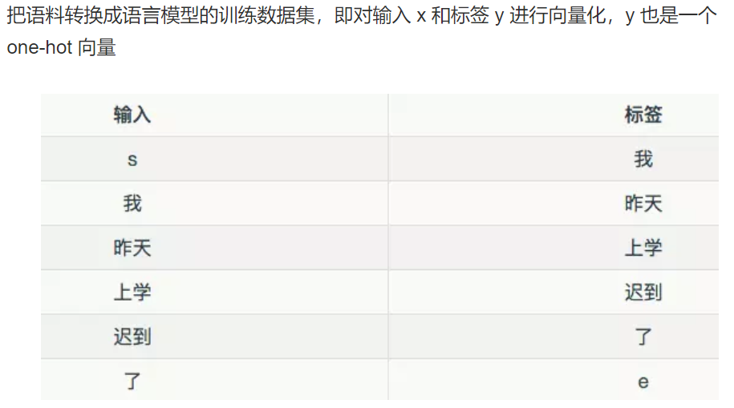
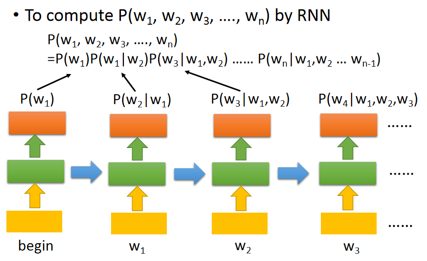

语言模型
===========
什么是语言模型
---------------
稍微总结下语言模型到底在建模什么——语言模型是得到一个句子（是人话）的概率。机器翻译、拼写纠错、音字转换、问答系统、语音识别等应用在得到若干候选之后，然后利用语言模型挑一个尽量靠谱的结果。

针对上述第1点缺陷，使用马尔科夫假设——为了解决參数空间过大的问题。引入了马尔科夫假设：随意一个词出现的概率只与它前面出现的有限的一个或者几个词有关。

前提是需要知道在给定一个序列的前提下，预测下一个词出现的概率，即

不论 n-gram 中的 n 怎么选取，实际上都是对上式的近似。理解了这点，就不难理解神经网络语言模型的本质。

一元语言模型
^^^^^^^^^^^^^^^

二元语言模型
^^^^^^^^^^^^^^

各种语言模型的区别
^^^^^^^^^^^^^^^^^^
无论是“统计语言模型”还是“NNLM”，只是对于上述“N-GRAM概率公式”的计算方法不同而已。

统计语言模型
-------------
1. 主要参考链接https://zhuanlan.zhihu.com/p/28080127
2. 辅助链接：https://zhuanlan.zhihu.com/p/52061158

- 并未对词进行任何representation，仅仅对“训练语料”做了数数。
- 基于统计的 n-gram 语言模型的特点
- 起始符与结束符
- 马尔科夫假设，针对语言用词之间关系的无限性
- 极大似然估计，针对语料的无限性

一元语言模型
^^^^^^^^^^^^
一个向量，N维（N代表语料中不同单字的个数），每个维度保存着每个单词的概率值。

二元语言模型
^^^^^^^^^^^^^^
一张二维表，表的行和列都是语料库中的单字。
矩阵的行表示词，列表示上下文，每个元素表示某个词和上下文共现的次数，这样矩阵的一行就描述了改词的上下文分布。
常见的上下文（矩阵的列）有：（1）文档，即“词-文档”矩阵；（2）上下文的每个词，即“词-词”矩阵；（3）n-元词组，即“词-n-元组”矩阵。矩阵中的每个元素为词和上下文共现的次数，通常会利用TF-IDF、取对数等技巧进行加权和平滑。另外，矩阵的维度较高并且非常稀疏，可以通过SVD、NMF等手段进行分解降维，变为低维稠密矩阵。

神经网络语言模型
-------------------

NNLM与word embedding
^^^^^^^^^^^^^^^^^^^^^^
词向量是NNLM中引入的概念，可以认为是神经网络训练语言模型的副产品。

NNLM
^^^^^^^
NNLM是监督学习。用语料训练完成神经网络模型之后，对于需要求概率的句子，按照训练时设定的Ngram来断句，把N-1个词向量作为输入，模型输出就是条件概率P(wi|wn−i+1,...,wi−1)。

Neural Network Language Model是对 n 元语言模型进行建模，估算 P(wi|wn−i+1,...,wi−1) 的概率值。与n-gram等模型区别在于：NNLM不用记数的方法来估算 n 元条件概率，而是使用一个三层的神经网络模型（前馈神经网络），根据上下文的表示以及上下文与目标词之间的关系进行建模求解。

参考链接：https://blog.csdn.net/aspirinvagrant/article/details/52928361

上述链接详细描述了“经典Bengio神经网络语言模型”，注意点细节如下：

1. 首先对于语料，类似于“统计语言模型”的做法，构建一个矩阵。矩阵每一列表示语料中出现的每一个词的“词向量”。即，C(w) 表示 w 对应的词向量，存储在矩阵 C 中，C(w) 为矩阵 C 中的一列，其中，矩阵 C 的大小为 m∗|V|，|V| 为语料库中总词数，m 为词向量的长度。问题是，这个初始词向量是怎么来的，维度如何确定？
2. 上图中“输入层”的神经元个数是n*m，n是NGram的N，m是词向量的维度。
3. Ngram体现在“输入层”神经元的个数N，一般不超过5（显然高于统计语言模型使用的ngram）。
4. 隐含层的激励函数是“双曲正切函数”
5. “隐含层”的神经元个数
6. 输出层的softmax结构，神经元的个数就是等于语料中所有词的个数。
7. “输出层”除了接收“隐含层”的输出，还接收“输入层”的输出（上图中虚线），难道是一个神经元有两个权重参数？见“输出层y的公式”
8. 类似于n-gram的方法构造training data，目标词是最后一个词，与skip-gram明显不同
9. Bengio 等人的工作只考虑对语言模型的建模，词向量只是语言模型结束的副产品，因此他们并没有指出哪一套向量作为词向量效果更好。此外，在NNLM中词向量出现在两个地方，输入层各词的词向量是从矩阵 Cm∗|V|Cm∗|V| 中取出一列，隐含层到输出层的权重矩阵 U|V|∗hU|V|∗h 中的向量是词向量的另一种表示 C′C′，C(w)C(w) 为词 ww 作为上下文的表示，C′(w)C′(w) 为词ww作为目标词的表示。

How to use NNLM
++++++++++++++++++
前提：训练时使用的是2gram模型

计算：“wreck a nice beach”这个句子是人话的概率

RNNLM
^^^^^^^^
Recurrent Neural Network based Language Model，

基于 RNN 的语言模型例子 https://www.jianshu.com/p/39a99c88a565第3点，这是一个实际的例子，从中可以窥探出RNNLM和NNLM的区别：

1. 这个例子是一个“一元语言模型”，因为在第一段表明，“每输入一个词”，输出“下一个最可能的词”.

其实，上图中

（1）输出层其实也是一个有N个神经元的softmax，N表示语料库中的词个数。
（2）隐藏层的神经元个数是m，用户指定，一般为10^2量级，参考
（3）输入层神经元个数就是词向量的维度

2. 如何从非标记文本中取得训练数据，涉及到语料库，分词，one-hot表示
3. 模型的输入，输出对

How to use RNNLM
++++++++++++++++++++++

C&W 模型2008
^^^^^^^^^^^^^
C&W 模型的实现工具是SENNA

LBL
^^^^^^
Log-Bilinear Language Model