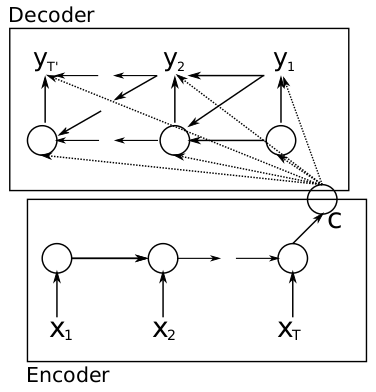
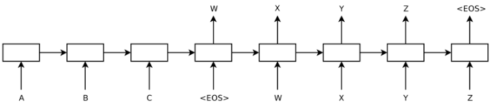

Seq2Seq
==========
 .. image:: images/s2s1.png

 上图中，参考链接, https://towardsdatascience.com/nlp-sequence-to-sequence-networks-part-2-seq2seq-model-encoderdecoder-model-6c22e29fd7e1

1. encoder的循环神经元的Output都丢弃了
2. Encoder和Decoder之间S的含义：the last state of Encoder’s recurrent layer as an initial state to the first recurrent layer of the decoder part.

Decoder的两种结构
----------------------
第一种，encoder最后输出的中间状态既作为softmax输入，也作为隐藏层的输入（见论文）

第二种，Decoder 的第一个时刻只用到了 Encoder 最后输出的中间状态变量 ：

