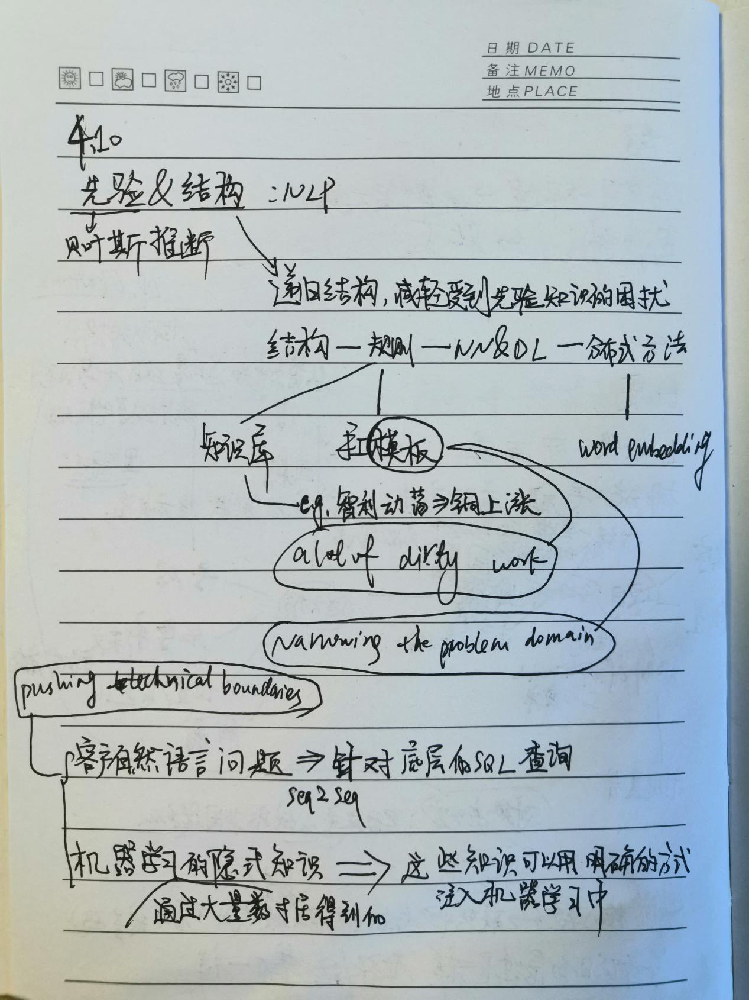

专用框架和工具
=================
参考 https://www.jiqizhixin.com/articles/2017-12-14-5

AllenNLP
---------

ParlAI
------------

OpenNMT
----------
OpenNMT 工具包是专用于序列到序列模型的通用框架，可用于执行机器翻译、摘要、图像到文本和语音识别等任务。

GNMT
-----

在商业中支持的应用
------------------
