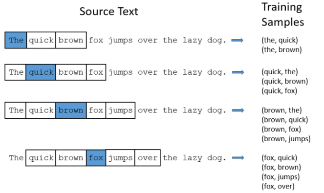
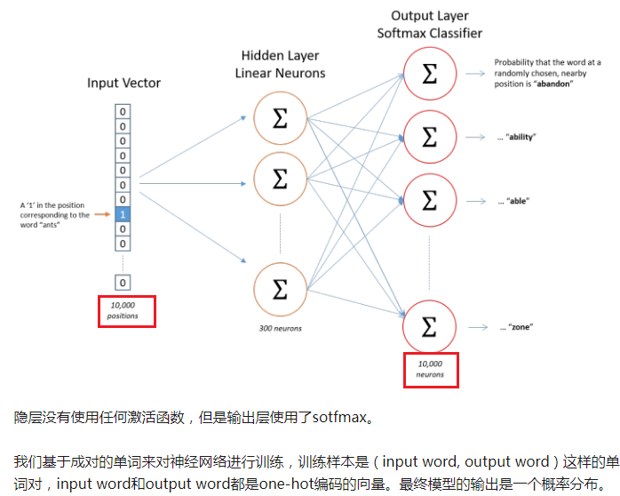

Word2Vec
==========
Word2vec是一类神经网络模型——在给定无标签的语料库的情况下，为语料库中的单词产生一个能表达语义的向量。这些向量通常是有用的：

1. 通过词向量来计算两个单词的语义相似性
2. 对某些监督型NLP任务如文本分类，语义分析构造特征

Word2Vec模型中，主要有Skip-Gram和CBOW两种模型，从直观上理解，Skip-Gram是给定input word来预测上下文。而CBOW是给定上下文，来预测input word。应该是体现在由

常识基础
---------
如果两个不同的单词有着非常相似的“上下文”（也就是窗口单词很相似，比如“Kitty climbed the tree”和“Cat climbed the tree”），那么通过我们的模型训练，这两个单词的嵌入向量将非常相似。

那么两个单词拥有相似的“上下文”到底是什么含义呢？比如对于同义词“intelligent”和“smart”，我们觉得这两个单词应该拥有相同的“上下文”。而例如”engine“和”transmission“这样相关的词语，可能也拥有着相似的上下文。

实际上，这种方法实际上也可以帮助你进行词干化（stemming），例如，神经网络对”ant“和”ants”两个单词会习得相似的词向量。
词干化（stemming）就是去除词缀得到词根的过程。

CBOW 2013
--------------

Skip-gram 2013	
------------------
这个链接中有详细的过程：https://zhuanlan.zhihu.com/p/27234078

下面用一张图来表示整个过程，如下图所示：

1. 上图中，从“语料”到“单词对”的过程

（1）每一个词都可以作为inputword
（2）每一个词的skip_window（关键参数，上图中的方框）中的词，都可以作为outputword。上图中的skip_window=2
（3）Inputword和outputword并没有按照原文出现的先后顺序

2. 神经网络的结构

（1）三层神经网络很像NNLM，区别是skip-gram的input layer 神经元的个数是固定的；
（2）最终的目标就是学习这个隐层的权重矩阵
（3）输出层是一个softmax回归分类器，它的每个结点将会输出一个0-1之间的值（概率），这个和NNLM以及RNNLM相同
（4）隐藏层神经元的个数就是词向量的维度

3. 以one-hot representation作为神经网络的输入
4. Training data的构造过程，与NNLM明显不同，Skip-gram中的目标词为词组的中间词，它的上下文共有 n−1个词，前后各有 (n−1)/2个词。
5. 作为非监督学习，怎么从文本中生成训练样本
6. 提高训练效率的方式

（1）合理分词，可以减少词汇表中词的个数，从而减少input layer和output layer的神经元个数，从而降低权重矩阵的维度。

7.Loss function的定义

Word2vec增强
------------------
http://kissg.me/2018/01/26/word_embeddings_3/