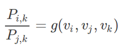
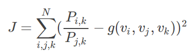
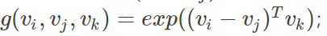

word_representation
======================
在计算Word representation的过程中要使用语言模型。

One-hot
--------------
Word（无论是分词后的word，还是未分词的word）的one-hot表示是word2vec的输入，可以有两种方法得到：
https://towardsdatascience.com/nlp-sequence-to-sequence-networks-part-1-processing-text-data-d141a5643b72

Character level processing
^^^^^^^^^^^^^^^^^^^^^^^^^^^^^^^^^^
最后，word的one-hot表示是一个“二维数组”。有一个问题啊，这个二维数组还会经过word embedding处理吗？

Word level processing
^^^^^^^^^^^^^^^^^^^^^^^^^^^
word的one-hot表示是一个“一维数组”，这个数组还要经过word embedding处理，得到一个固定长度的向量。

分布式表示
---------------
通过语言模型，将语义融入word representation。

- 1954，上下文相似的词，语义也相似
- 1957,词的语义由其上下文决定

训练方法
^^^^^^^^^^^^^
Word embedding的训练方法大致可以分为两类：一类是无监督或弱监督的预训练；一类是端对端（end to end）的有监督训练。 

无监督或弱监督的预训练以word2vec和auto-encoder为代表。我们往往会在得到预训练的embedding向量后，用少量人工标注的样本去fine-tune整个模型。

与无监督模型相比，端对端的模型在结构上往往更加复杂。同时，也因为有着明确的任务导向，端对端模型学习到的embedding向量也往往更加准确。例如，通过一个embedding层和若干个卷积层连接而成的深度神经网络以实现对句子的情感分类，可以学习到语义更丰富的词向量表达。

基于矩阵的Glove
^^^^^^^^^^^^^^^^^^^^
一、这种表示方法的语言模型是“统计语言模型”，“共现矩阵”就是体现。

二、下述几点可以参考：https://blog.csdn.net/coderTC/article/details/73864097

1. 整体的实现流程
2. 共现矩阵的实现，基于矩阵中的“矩阵”应该就是“共现矩阵”
3. GloVe模型可能只是“训练词向量”的一个方法，使词向量中蕴含了共现矩阵中所蕴含的信息，那到底是什么信息呢？
4. GloVe模型中代价函数的构造过程，通过使该目标函数最小来得到最终的词向量
5. GloVe模型采用了类似机器学习的方法，其中的几个关键点：

(1) 词向量就是超参数，类似于房价预测，要构建一个等式

(2）定义cost function

(3）构建hypothesis
不能用多项式，得用矩阵/向量的计算方法

基于神经网络的Word2Vec
^^^^^^^^^^^^^^^^^^^^^^^^^
基于神经网络的分布表示一般称为词向量、词嵌入（ word embedding）或分布式表示（ distributed representation）。

词向量可以认为是神经网络训练语言模型的副产品。

前面提过，one-hot表示法具有维度过大的缺点，那么现在将vector做一些改进：

1. 将vector每一个元素由整形改为浮点型，变为整个实数范围的表示；
2. 将原来稀疏的巨大维度压缩嵌入到一个更小维度的空间。这也是词向量又名词“嵌入”的缘由了。

预训练模型
^^^^^^^^^^^^

最初，对于一个需要词嵌入的 NLP 问题，我们倾向于利用与领域相关的大型语料库训练自己的模型。当然，这不是推进词嵌入广泛使用的最佳方式，因此人们开始慢慢转向预训练模型。通过在维基百科、推特、谷歌新闻、网页抓取内容等上面进行训练，这些模型可以轻松地把词嵌入整合到 DL 算法中。

未来将会有针对特定领域（比如生物、文学、经济等）、易于在 NLP 框架中使用的预训练模型。

FastText
++++++++++++
来自 Facebook 人工智能实验室（FAIR）的 fastText 发布了 294 种语言的预训练向量，对社区做出了重大贡献。除了大量的语言，fastText 这一举措的有用之处在于其使用字符 n 元作为特征。这使得 fastText 避免了 OOV（out of vocabulary）问题，因为即使非常罕见的词（比如特定领域的术语）也很可能与常见词共享字符 n 元。在这个意义上，fastText 要比 word2vec 和 GloVe 表现更好，并且它在小数据集上的表现也要优于二者。

fasttext的中文预训练词向量：https://fasttext.cc/docs/en/crawl-vectors.html

spaCy
+++++++++
NLP 框架 spaCy 通过整合词嵌入和 DL 模型以本地方式完成诸如命名实体识别（NER）和依存句法分析（Dependency Parsing）等任务，允许用户更新模型或使用他们自己的模型。

Chinese word vectors
++++++++++++++++++++++++
目前最全的中文预训练词向量集合
https://github.com/Embedding/Chinese-Word-Vectors

使用建议
^^^^^^^^^^
另外一点很实用的建议，在你做某一项具体的NLP任务时如你要用到词向量，那么我建议你：要么 

1. 选择使用别人训练好的词向量，注意，得使用相同语料内容领域的词向量；要么 
2. 自己训练自己的词向量。

我建议是前者，因为……坑太多了。